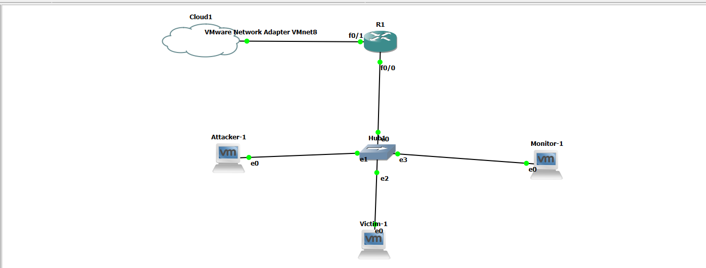

# 🛡️ Mini Intrusion Detection & Response System (IDRS) — Lab README

**A compact, self-contained lab that demonstrates real-time intrusion detection and automated response using an IDS script (Scapy), Cisco router ACLs (Netmiko), and victim host hardening (Paramiko + iptables).**

---

## 🧠 Project Overview

This project implements a **mini Intrusion Detection & Response System (IDRS)** designed for **teaching and demonstration** purposes.  

It:

- Captures live network traffic using **Scapy**.
- Detects common attack types:  
  - XMAS / Nmap scans  
  - TCP SYN floods  
  - SSH brute-force attempts
- Responds automatically by:
  - Adding `deny ip host <attacker> any` to a Cisco router ACL (via **Netmiko**).
  - Inserting an `iptables` DROP rule on the victim host (via **Paramiko** SSH).
- Logs detections and actions to `/var/log/ids.log`.
- Supports a **whitelist** file and a **Streamlit dashboard** for monitoring and manual control.

🧩 **Lab flow**: Attacker → Router → Victim, with the **Monitor** node inspecting traffic and orchestrating the automated response.

---

## 🧠 Key Features

✅ **Real-time Detection** using `Scapy` packet analysis  
✅ **Automatic Response** — blocks attacker IPs on:
   - Cisco Router (via ACLs)
   - Victim host (via iptables)  
✅ **Dashboard Interface** built with `Streamlit` for:
   - Live attack logs
   - Manual block/unblock actions
   - Whitelist management  
✅ **Modular Design** — easy to extend and integrate  
✅ **Learning-focused** — ideal for cybersecurity students and labs 

---

## ⚙️ Architecture & Components

**Virtual Machines (VMs):**

| Role | OS | Description |
|------|----|--------------|
| **Attacker** | Kali Linux | Uses tools like `nmap`, `hping3`, `hydra` |
| **Victim** | Ubuntu | Runs `ssh`, managed via `iptables` |
| **Monitor** | Ubuntu | Runs IDS scripts (`idrs_monitor.py`, dashboard) |

**Emulation:**
- Cisco Router (c7200) via **GNS3**, bridging VMware networks (internal & NAT).

**Key Scripts:**
- `idrs_monitor.py` — main IDS + auto-response engine  
- `idrs_dashboard.py` — optional Streamlit dashboard  

**Libraries Used:**  
`scapy`, `netmiko`, `paramiko`, `streamlit`, `pandas`, `plotly`

---

## 🧩 Prerequisites

- VMware Workstation Pro / Player + GNS3 integration  
- 3 VMs configured: Attacker, Victim, Monitor  
- Cisco Router image (e.g., c7200) in GNS3  
- Python 3.13 on the Monitor VM  

---

## 🌐 Network Design (GNS3 + VMware)


---

## 🏗️ GNS3 & VMware Integration (Step-by-Step Guide)

### A. Preparations (Before Setting Up GNS3)

1. **Run VMware Workstation Pro as Administrator**.
2. **Open Virtual Network Editor** and configure:

   * **VMnet2 — Host-Only** (no DHCP, allow promiscuous mode, subnet 192.168.10.0/24)
   * **VMnet8 — NAT** (leave default)
3. **Set VM network adapters** to Host-Only → VMnet2.
4. **Enable promiscuous mode** for the Monitor VM.

### B. GNS3: Create Cloud Nodes Bound to VMnet2 & VMnet8

1. Open GNS3 as Administrator.
2. Add **Cloud** and bind to VMnet2 and VMnet8.
3. Add a **Hub** and connect Cloud-VMnet2 → Hub.
4. Connect Router Fa0/0 → Hub and Fa0/1 → Cloud-VMnet8.

### C. VMware VM ↔ GNS3 Link Mapping

* VMnet2 connects Attacker, Victim, Monitor, and Router Fa0/0.
* VMnet8 connects Router Fa0/1 to internet through NAT.

### D. For Router configuration check-out ROUTER_CONFIG.md 

### E. Configure VM Networking (Ubuntu/Kali)

```bash
sudo dhclient -v eth0
ip address
ping 192.168.10.1
```

### F. Connectivity Verification

* Renew DHCP.
* Ping router.
* From Monitor:

```bash
sudo tcpdump -i eth0 -nn -c 50
```

### G. Quick Checklist

* Cloud nodes mapped to VMnet2/VMnet8.
* Hub forwarding traffic.
* Monitor sees traffic.

### H. Common Troubleshooting

* Cloud adapter missing → run GNS3 as Admin.
* DHCP not working → disable VMware DHCP on VMnet2.
* Promiscuous mode issues → ensure hub is used.

### I. Final Topology Summary

* Cloud-VMnet2 → Hub → Attacker / Victim / Monitor / Router Fa0/0
* Cloud-VMnet8 → Router Fa0/1

---

## ⚡ Installation & Setup

1. Clone the repo:
    ```bash
    git clone https://github.com/VishvaNarkar/Mini-IDRS.git
    cd Mini-IDRS
    ```

2. Ensure log file exists and writable by the process:
   ```bash
   sudo touch /var/log/ids.log
   sudo chown $(whoami) /var/log/ids.log
   ```
3. Create a whitelist file:
   ```bash
   nano whitelist.txt
   ```

   Example contents:
   ```bash
   192.168.10.1   # Router
   192.168.10.10  # Monitor
   127.0.0.1
   ```

4. Create a virtual environment:
    ```bash
    python3 -m venv venv
    source venv/bin/activate
    ```

5. Install require dependencies:
    ```bash
    pip3 install -r requirements.txt
    ```

6. Edit configuration variables near the top of idrs_monitor.py and idrs_dashboard.py if your IPs or credentials differ.

7. (Recommended) Configure the **victim** user to allow passwordless sudo for iptables:
   ```bash
   sudo visudo
   # add:
   monitoruser ALL=(ALL) NOPASSWD: /sbin/iptables, /usr/sbin/iptables
   ```

---

## 📂 Directory layout

```
/home/monitor/Mini-IDRS/
├── idrs_monitor.py
├── idrs_dashboard.py
├── requirements.txt
├── whitelist.txt
├── README.md
├── CONTRIBUTING.md
├── LICENSE
├── .gitignore
└── /var/log/ids.log
```

---

## ⚙️ Configuration

Open `idrs_monitor.py` and update the following variables to match your lab:

- `ROUTER_IP`, `ROUTER_SSH_USER`, `ROUTER_SSH_PASS`

- `VICTIM_IP`, `VICTIM_SSH_USER`, `VICTIM_SSH_PASS`

- `WHITELIST_FILE path` (defaults to `/home/monitor/Mini-IDRS/whitelist.txt`)

- Detection thresholds:

  - `SYN_THRESHOLD`,
  - `SYN_WINDOW_SECONDS`

SSH_THRESHOLD, SSH_WINDOW_SECONDS

Tuning thresholds is essential for lab reproducibility — e.g., `hping3 -i u1000` sends ≈1000 packets/sec, so set `SYN_THRESHOLD` accordingly.

---

## ▶️ How to Run

Start IDS monitor on the Monitor VM:

```bash
sudo python3 idrs_monitor.py -i ens33
```

Launch dashboard:

```bash
streamlit run idrs_dashboard.py
```

---

## 💣 Attack Detection Examples & Remediation

⚠️ **Note**: Run these commands **only in a controlled lab environment.**

1️⃣ **Nmap XMAS Scan Detection**

**From Attacker:**
```bash
nmap -sX <victim's IP>
```

***Verify Router ACL:***
```bash
show access-lists IDS_BLOCK_LIST
```

**Expected Output:**
```bash
Extended IP access list IDS_BLOCK_LIST
    deny ip host <attacker's IP> any log
```

2️⃣ **SYN Flood Detection**

**From Attacker:**
```bash
hping3 -S <victim's IP> -p 22 --flood
# or rate-limited flood:
sudo hping3 -S -p 22 -i u1000 <victim's IP>
```

**Verify Router ACL:**
```bash
show ip access-lists IDS_BLOCK_LIST
```

Expect `deny ip host <attacker' IP> any`.

3️⃣ **SSH Brute-Force Detection**

**From Attacker:**
```bash
hydra -l root -P wordlist.txt ssh://<victim's IP>
```

**Check Router ACL:**
```bash
show access-lists IDS_BLOCK_LIST
```

🔍 Router Verification & Removal of ACL Entry

**Show ACL:**
```bash
show access-lists IDS_BLOCK_LIST
```

**Remove entry:**
```bash
conf t
ip access-list extended IDS_BLOCK_LIST
 no deny ip host <attacker' IP> any
exit
write memory
```

🧱 Check / Remove iptables Rules (Victim)

**View current rules:**
```bash
sudo iptables -L -n -v
```

**Remove by IP:**
```bash
sudo iptables -D INPUT -s <attacker' IP> -j DROP
sudo iptables -D FORWARD -s <attacker' IP> -j DROP
```

Or use a safe loop:
```bash
sudo iptables -S INPUT | grep "<attacker' IP>" | while read -r rule; do sudo iptables ${rule/-A/-D}; done
```

---

## ✅ Verification Checklist

**1. Start monitor and tail logs:**
```bash
sudo tail -f /var/log/ids.log
```

**2. Run attack example from attacker.**

**3. Look for detection entries:**
```bash
2025-10-14 10:53:42 INFO SYN_FLOOD | attacker=192.168.10.12 | victim=192.168.10.11 | 100 SYNs in 10s
2025-10-14 10:53:43 INFO [BLOCK_RESULT] attacker=192.168.10.12 router=(True,'...') victim=(True,'...')
```

**4. Check router ACL and victim iptables for the block.**

---

## 🧰 Troubleshooting & Common Issues

| Issue                                    | Solution                                                                                 |
| ---------------------------------------- | ---------------------------------------------------------------------------------------- |
| **Scapy permission denied**              | Run with `sudo`                                                                          |
| **Interface not found**                  | `ip link show` or `python3 -c "from scapy.all import get_if_list; print(get_if_list())"` |
| **Netmiko/Paramiko auth errors**         | Verify SSH credentials                                                                   |
| **False positives**                      | Adjust `SYN_THRESHOLD` / `SSH_THRESHOLD`                                                 |
| **Streamlit error (experimental_rerun)** | Replace `st.experimental_rerun()` with `st.rerun()`                                      |

---

## 🔒 Security Considerations & Best Practices
- **Do not** use on production networks.
- Protect router/victim credentials (use SSH keys).
- Limit dashboard access (`localhost` binding).
- Store sensitive config in `.env` or environment variables.
- Persist firewall rules using `iptables-save`.

---

## 🚀 Future Improvements
- REST API (FastAPI) for control
- Replace `iptables` with `nftables`
- “Dry-run” alert-only mode
- Integrate threat intelligence (AbuseIPDB)
- Add ML-based anomaly detection

---

## 📚 References & Resources

- [Scapy](https://scapy.net/)

- [Netmiko](https://ktbyers.github.io/netmiko/)

- [Paramiko](http://www.paramiko.org/)

- [Streamlit](https://streamlit.io/)

- Cisco IOS ACL Documentation

- [Cisco C7200 Route] 

---

## 📄 License

This project is released under the **MIT License** — see `LICENSE` for full text.

---

## 👨‍💻 Authors / Contributors

**Vishva Narkar** — Student 

**Himesh Nayak** — Student 

---

## 🙏 Acknowledgements

Thanks to open-source projects **Scapy, Netmiko, Paramiko**, and **Streamlit**, and the Cisco documentation community.

---

## ✅ Notes

Replace all placeholder IPs and credentials with your lab’s values before publishing.
Use `.gitignore` to exclude sensitive data and configuration files